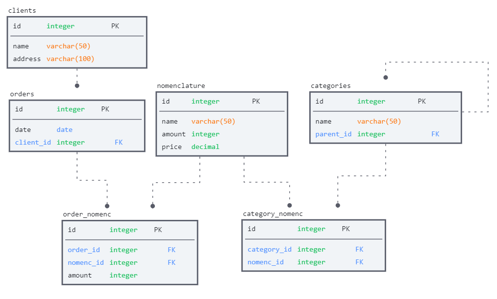

### Задание 1. Сетевой фонарь

[flashlight.py](company_02/flashlight.py) - решение.  
[tests.py](company_02/tests.py) - юниттесты, написанные в процессе реализации.

### Установка пакета:
> pip install flashlight-pavel-ivanov928==1.2

### Запуск программы:
```python
import asyncio
from flashlight.flashlight import main
asyncio.run(main())
```

### Задание 2. Проектирование БД.
Предложенная мной схема БД. В принципе таблица *category_nomenc* не обязательна, т.к. связи многие ко многим тут нет, 
а для один ко многим хватило бы и просто поля *category_id* в таблице *nomenclature*.
</details>

### SQL запросы:
1) Получение информации о сумме товаров заказанных под каждого клиента (Наименование клиента, сумма)
```sql
SELECT 
    clients.name as client_name,
    SUM(order_numenc.amount * nomenclature.price) as sum
FROM
    orders
JOIN order_numenc ON orders.id = order_nomenc.order_id
JOIN nomenclature ON order_nomenc. nomenc_id = nomenclature.id
JOIN clients ON orders.client_id = clients.id
GROUP BY clients.name
```
2) Найти количество дочерних элементов первого уровня вложенности для категорий номенклатуры.
```sql
SELECT 
    c1.name,
    (SELECT COUNT(*)
     FROM categories c2
     WHERE parent_id = c1.id) as children_amount
FROM categories as c1
```